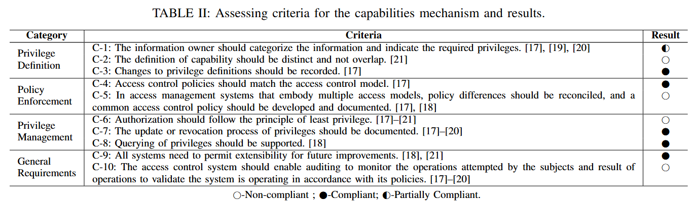

# CAPAssess - A assess framework for Linux capabilities. 
CAPAsses provides three tools and 10 metrics to identify potential problems in capabilities's design, implementation, and configuration. Specifically, the 3 tools are:
- Overlap Analyzer, quantifies capabilities based on kernel functions and detects overlaps in privilege definition. 
- Conflict Analyzer, explores the relationship between capabilities and UGO.
- Capability Fuzzer, recognizes the capabilities needed by commands.
## prerequisites
For Overlap Analyzer and Conflict Analyzer, LLVM and compiler with C++ support are needed. For Capability Fuzzer, the Python environment must be installed. To avoid irreversible impact of some commands on the system, you are advised to run scripts on VMS.   
## usage
- Overlap Analyzer
  1. Download the source code for the kernel version you want to analyze.
  2. get make results
``make allyesconfig ; make -k V=1 > /makeres.txt``
  3. Use scripts to process the results of gcc compilation.
``python handle.py``
this step generates gcc.txt
  4. Execute make_kernel.py in the directory of kernel source code.
- Conflict Analyzer
  The usage is similar to the PeX. Please check: https://github.com/lzto/pex, commit e2855417d2e.
- Capability Fuzzer
  Put the command you want fuzz in the file, one command per line, and run 
``python3 run_all_scripts.py target_commands``.
## results 
We reported identified problems to relvant partied and collect their responses. The results are shown in capassess_appendix.pdf.
A quick overview of the metrics and assess results:

Some problems identified by CAPAssess and the process of solving them:

ctrlaltdel: remove unnecessary uid check. (https://github.com/util-linux/util-linux/pull/2719)

ping: an extra capability is needed in configuration. (https://github.com/iputils/iputils/issues/515)

kernel patch: remove the overlap between CAP_SYS_ADMIN and CAP_SYSLOG. (https://git.kernel.org/pub/scm/linux/kernel/git/kees/linux.git/commit/?id=09ce61e27db8)

  
